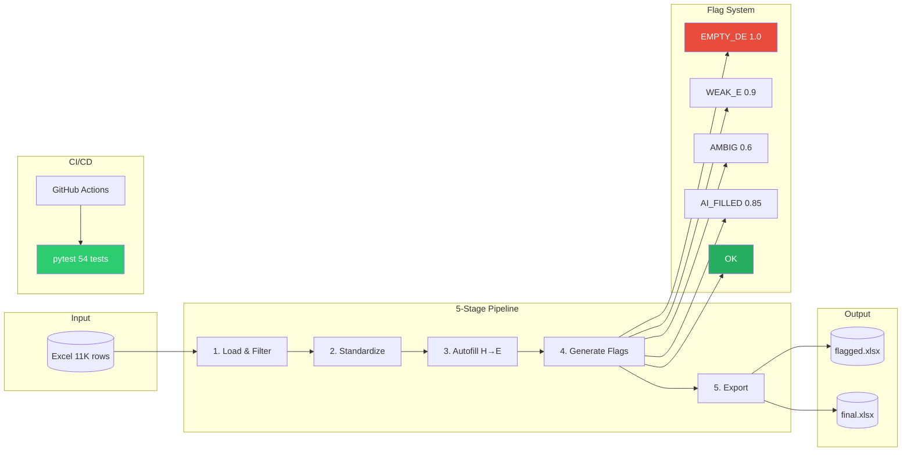

# QA Data Pipeline

Automated QA validation pipeline for large-scale regulatory data processing.
## diagram 



 

    
## Features

- **Flag Generation**: Detect data quality issues with confidence scores
  - EMPTY_DE: Completely unreviewed rows
  - WEAK_E: Insufficient evidence
  - AMBIG: Ambiguous cases
  - ATTACH: Attachment references
  - LAW_FIX: Law/regulation changes
  - NUM_FIX: Numeric value changes
  - AI_FILLED: Auto-filled from AI

- **Label Standardization**: Normalize D column variations
- **Auto-fill**: Fill empty E columns from AI-extracted data (H column)
- **Pipeline Orchestration**: Run all stages in order with progress tracking
- **Metrics**: Prometheus-compatible metrics collection
- **Logging**: Structured JSON logging

## Installation

```bash
git clone https://github.com/kim-kyoungyeon/qa-data-pipeline.git
cd qa-data-pipeline
pip install -r requirements.txt
```

## Quick Start

```bash
# Run pipeline
python main.py data/input.xlsx

# With options
python main.py data/input.xlsx --output-dir ./results --range 4-1 5-2

# Skip autofill, output as JSON
python main.py data/input.xlsx --no-autofill --json
```

## CLI Options

| Option | Description |
|--------|-------------|
| `-o, --output-dir` | Output directory (default: output) |
| `--format` | Output format: xlsx or csv |
| `--no-standardize` | Skip label standardization |
| `--no-autofill` | Skip auto-fill from AI data |
| `--no-flag` | Skip flag generation |
| `--range START END` | Filter by item range (e.g., 4-1 5-2) |
| `-c, --config` | Custom config file path |
| `--json` | Output results as JSON |
| `-v, --verbose` | Verbose output |
| `-q, --quiet` | Errors only |

## Pipeline Stages

```
Input Excel
    |
    v
[1. Load] -- Read Excel file
    |
    v
[2. Filter] -- Optional: filter by item range
    |
    v
[3. Standardize] -- Normalize D column labels
    |
    v
[4. Autofill] -- Fill E from AI data (H column)
    |
    v
[5. Flag] -- Generate validation flags
    |
    v
[6. Export] -- Save flagged + final Excel
    |
    v
Output Files
```

## Project Structure

```
qa-data-pipeline/
├── src/
│   ├── __init__.py
│   ├── config.py           # YAML config loader
│   ├── flag_generator.py   # Flag detection with confidence
│   ├── standardize.py      # D column normalization
│   ├── autofill.py         # E column auto-fill
│   ├── data_merger.py      # Merge/diff utilities
│   ├── pipeline.py         # Orchestrator
│   ├── logging_utils.py    # Structured logging
│   └── metrics.py          # Prometheus metrics
├── config/
│   └── config.yaml         # Configuration
├── tests/
│   ├── test_flag_generator.py
│   ├── test_standardize.py
│   └── test_pipeline.py
├── sample_data/
│   └── sample_input.xlsx
├── main.py                 # CLI entry point
├── Dockerfile
├── docker-compose.yml
├── Makefile
├── requirements.txt
└── README.md
```

## Configuration

Edit `config/config.yaml`:

```yaml
columns:
  city: "도시명"
  item: "항목명"
  status: "이상유무 및 수정값"    # D column
  content: "조항내용"            # E column
  ai_content: "조항내용.1"       # H column (AI)

validation:
  min_content_length: 40
  min_ai_content_length: 30
```

## Development

```bash
# Install dev dependencies
make install

# Run tests
make test

# Run linter
make lint

# Build Docker image
make docker-build

# Run in Docker
make docker-run
```

## Docker

```bash
# Build
docker build -t qa-pipeline .

# Run
docker run -v $(pwd)/data:/app/data qa-pipeline \
    data/input.xlsx --output-dir /app/output
```

## Metrics

When `prometheus-client` is installed, metrics are available:

- `qa_pipeline_runs_total{status}` - Total pipeline runs
- `qa_pipeline_rows_total` - Rows processed
- `qa_pipeline_flags_total{flag_type}` - Flags generated
- `qa_pipeline_stage_seconds{stage}` - Stage duration

## API Usage

```python
from src import run_pipeline, FlagType, process_dataframe

# Run full pipeline
result = run_pipeline("input.xlsx", output_dir="output")
print(f"Flagged: {result.final_stats['flagged_rows']} rows")

# Or use individual components
import pandas as pd
from src.flag_generator import process_dataframe, get_flag_statistics

df = pd.read_excel("input.xlsx")
flagged_df = process_dataframe(df)
stats = get_flag_statistics(df)
```

## Tech Stack

| Component | Technology |
|-----------|------------|
| Language | Python 3.10+ |
| Data | pandas, openpyxl |
| Config | PyYAML |
| Testing | pytest |
| Metrics | prometheus-client |
| Container | Docker |
| CI/CD | GitHub Actions |

## License

MIT
